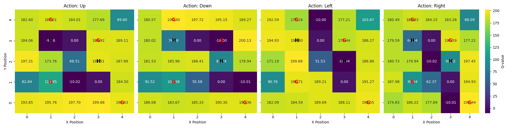
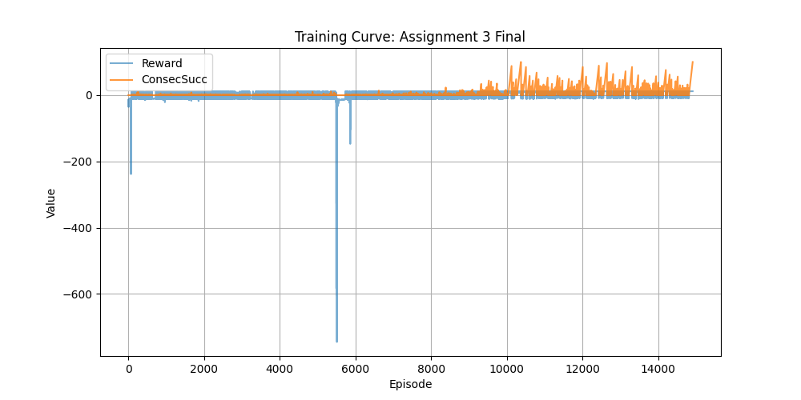

# RL_Projects
# Reinforcement Learning Projects – TH Ingolstadt

This repository contains my reinforcement learning projects completed as part of the **Master’s program in AI Engineering for Autonomous Systems at TH Ingolstadt**.  
The projects explore intelligent agent behaviour in custom simulation environments using **Q-Learning**, **Deep Q-Networks (DQN)**, and environment design with **Gymnasium**.

---

## 📂 Project Overview

### **1. Forest Forage Environment (Assignment 1 & 2)**
A grid-world simulation where an agent must collect berries while avoiding traps.

**Features:**
- Custom Gymnasium environment  
- Grid-based movement  
- Positive reward for berries; negative for traps  
- Episode termination conditions  
- Rendering with matplotlib and sprite icons  

**Files:**
- `assignment1_project.py`
- `forest_forage_env_assignment2.py`
- `q_learning_forest.py`
- `main.py`
- `Berries.png`
- `bear-trap-.png`

---

### **2. Q-Learning Agent**
An implementation of Q-learning for navigating the Forest Forage environment.

**Key concepts:**
- Epsilon-greedy exploration  
- Reward shaping  
- Q-table visualization (per-action heatmaps)  
- Saving results and plots  

---

### **3. Deep Q-Network (DQN) – Continuous Maze Environment (Assignment 3)**
A more advanced agent trained using Deep Q-Learning in a continuous-space maze with danger zones, walls, and a goal.

**Features:**
- Custom `ContinuousMazeEnv` environment  
- Neural network function approximation (PyTorch)  
- Replay buffer  
- Target network updates  
- Epsilon decay  
- Training and evaluation plots  

**Files:**
- `env.py`
- `DQN_model.py`
- `utils.py`
- `main.py`

---

## 🧠 Technologies Used
- **Python**
- **Gymnasium**
- **NumPy**
- **Matplotlib / Seaborn**
- **PyTorch**
- **Reinforcement Learning Algorithms**
  - Q-Learning
  - Deep Q-Network (DQN)

---

## 📊 Results

Generated outputs include:
- **Training reward curves**
- **Q-table heatmaps**
- **Consecutive success charts**
- **Saved model weights (`dqn_maze.pth`)**

Example plots:
- `training_rewards.png`
- `all_q_values.png`
- `training_curve.png`

---
## 📊 Example Output

### Q-Table Heatmap


### Training Reward Curve


### DQN Training Curve



## 🚀 How to Run

### **1. Install required libraries**
```bash
pip install numpy matplotlib seaborn gymnasium torch

python q_learning_forest.py
python main.py


